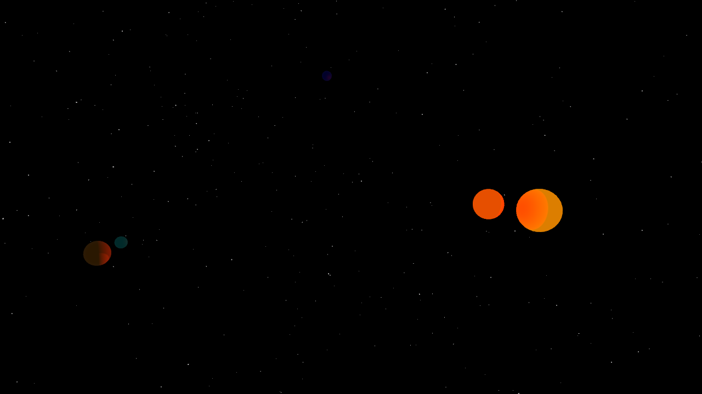

# Some canceled space game

Was just experimenting with bevy a little bit, that's it.

- You can fly around and look around in 3D.
- WASD + shift + spacebar to accelerate.
- Gravity is simulated, orbits are not hard-coded, and are just a result of initial position and initial velocity, which are hard-coded.

